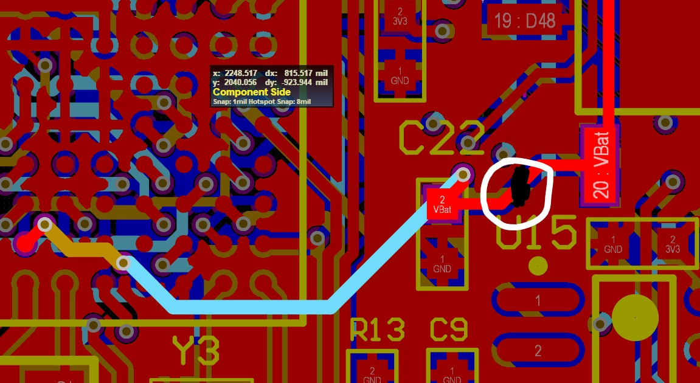
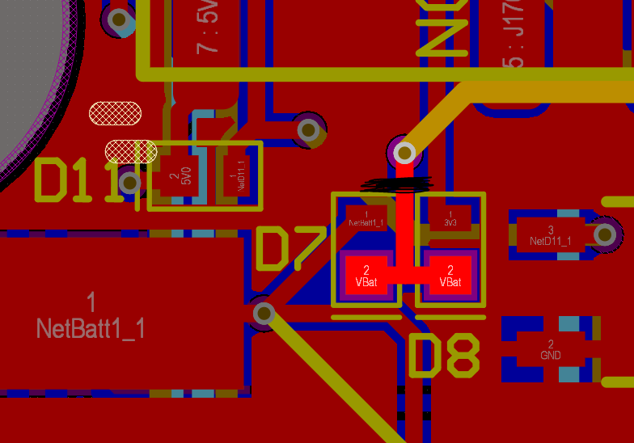
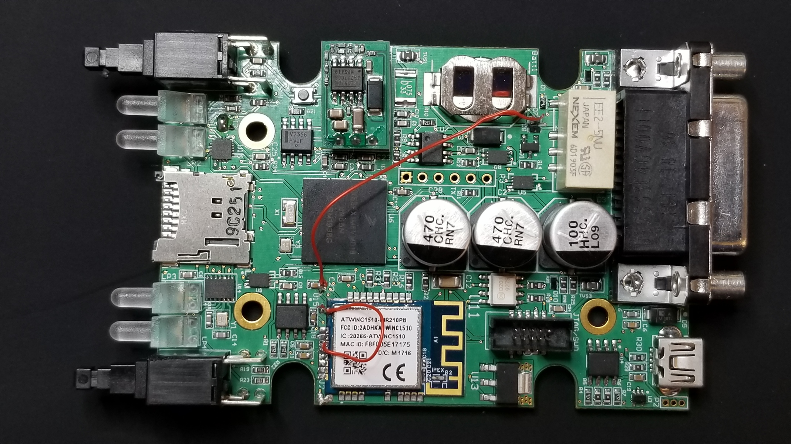

#Errata

It was observed that the coin batteries were draining faster than they should and the issue was found out to be a connection of Vbat to the Wifi module on pin 20.

To fix this issues the following fixes need to be done on the boards (version 3c).

1. remove copper in the regions marked in black in the below regions

2. Remove the Diode D7 and join both the pads with a wire (30 AWG preffered) and connect the other end of the wire to C22 (Vbat pad).

3.Jump a connection from pin 20 to pin 23 on the WiFi module (ATWINC1510) please refer the below immage.

